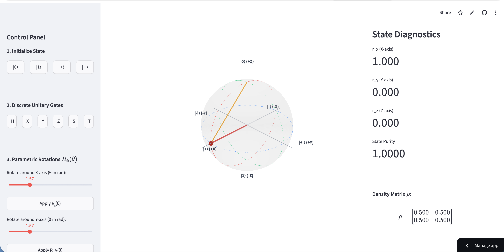

## Interactive Bloch Sphere Visualizer
This is a real-time interactive visualisation of the bloch sphere. It simulates quantum dynamics and transformations. 
To launch the live app: https://bloch-sphere-visualizer.streamlit.app

  

## Geometric Intuition & Mathematical Framework

The Bloch sphere is a 3D geometric representation of a single-qubit quantum state. It provides an interactive, intuitive manner of understanding qubit evolution by translating abstract linear algebra into physical spatial rotations.

### The State Vector
Any pure state of a single qubit can be mapped to a point on the surface of a unit sphere. By ignoring the global phase the state can be parameterized by a polar angle $\theta$ and an azimuthal angle $\phi$:
$$|\psi\rangle = \cos(\theta/2)|0\rangle + e^{i\phi}\sin(\theta/2)|1\rangle$$
where $0 \le \theta \le \pi$ defines the latitude (probability amplitude) and $0 \le \phi < 2\pi$ defines the longitude (relative phase). 

### The Density Matrix Formulation
While state vectors describe pure states, this engine utilizes the density matrix $\rho$ to allow for a complete description of both pure and mixed states. The density matrix is defined as $\rho = |\psi\rangle\langle\psi|$. 

For a two-level quantum system, $\rho$ can be decomposed using the identity matrix $I$ and the vector of Pauli matrices $\vec{\sigma} = (\sigma_x, \sigma_y, \sigma_z)$:
$$\rho = \frac{1}{2}(I + \vec{r} \cdot \vec{\sigma})$$
The vector $\vec{r} = (r_x, r_y, r_z)$ is the **Bloch vector**. For pure states, the length of this vector is strictly $|\vec{r}| = 1$, placing the state exactly on the surface of the sphere.

### Unitary Evolution
When a quantum gate (a unitary operator $U$) is applied to the qubit, the density matrix evolves according to the von Neumann equation for discrete transformations:
$$\rho' = U\rho U^\dagger$$
Because the Pauli matrices generate the Lie algebra of the $SU(2)$ rotation group, any unitary gate applied to the state vector corresponds identically to a 3D spatial rotation of the Bloch vector $\vec{r}$ in $SO(3)$ space. This allows us to visualize complex quantum gate sequences as continuous orbital trajectories.

### Example: The Hadamard Transformation
Consider the Hadamard gate ($H$), which maps computational basis states into equal superpositions. 

If the system begins in the ground state $|0\rangle$, it is positioned at the North Pole of the Bloch sphere with coordinates $\vec{r} = (0, 0, 1)$. Applying the Hadamard gate algebraically yields:
$$H|0\rangle = |+\rangle = \frac{1}{\sqrt{2}}(|0\rangle + |1\rangle)$$
Geometrically, the $H$ gate corresponds to a rotation of $\pi$ radians about the axis $(\hat{x} + \hat{z})/\sqrt{2}$. The visualizer immediately reflects this mathematically by sweeping the state vector from the North Pole $(0,0,1)$ down to the equator at $(1, 0, 0)$, beautifully demonstrating how the qubit enters a state of maximum superposition.

